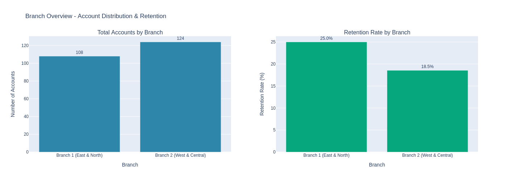
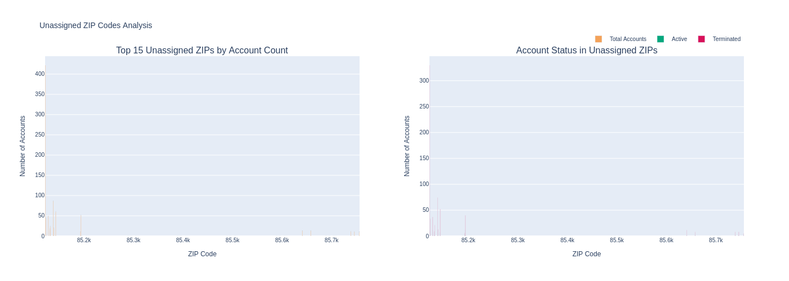
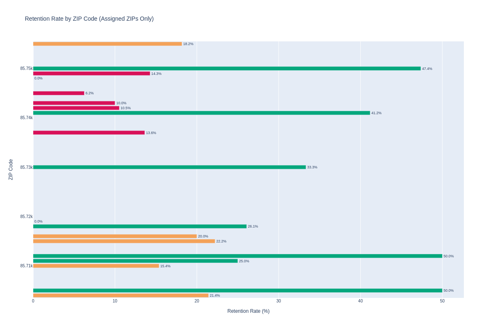

# Tucson Branch Decentralization
## Strategic Analysis Report

---

**Prepared:** October 23, 2025  
**Subject:** Evaluation of Proposed 2-Branch Territory Reorganization  
**Primary Metric:** Customer Retention Improvement

---

## Executive Summary

This analysis evaluates the proposed decentralization of the Tucson service area from a single branch into two geographically-defined territories. The analysis maps current and terminated accounts to the proposed branches, identifies gaps in the territorial plan, and provides strategic recommendations for implementation.

### Key Findings

1. **Overall Portfolio Health**
   - Total accounts in database: **1,097**
   - Overall retention rate: **21.55%** (critically low)
   - Active accounts: **236**
   - Terminated accounts: **861**

2. **Territory Coverage Gap**
   - **78.9% of accounts (865 accounts) are in unassigned ZIP codes**
   - Casa Grande alone represents **44.0% of all accounts** (483 accounts)
   - The proposed plan covers only **21.1% of the account base**

3. **Retention Crisis**
   - Current retention rate of 21.6% indicates severe operational issues
   - Both proposed branches show retention rates below 25%
   - Multiple ZIP codes have 0% retention (all accounts terminated)

4. **Branch Balance**
   - Branch 1 (East & North): 108 accounts (46.6% of assigned)
   - Branch 2 (West & Central): 124 accounts (53.4% of assigned)
   - Distribution is reasonably balanced among assigned territories

---

## Detailed Analysis

### 1. Proposed Branch Territories

The decentralization plan divides Tucson into two branches based on geographic and demographic characteristics:

#### Branch 1 - Tucson East & North (The Foothills Branch)
- **Target Market:** High-value Catalina Foothills, Northeast, and established East Side
- **ZIP Codes Assigned:** 85718, 85749, 85750, 85710, 85748, 85730, 85715, 85711 (8 ZIPs)
- **Actual Account Data:**
  - Active accounts: 27
  - Terminated accounts: 81
  - Total accounts: 108
  - **Retention rate: 25.00%**
  - Active annual revenue: **$52,278.04**

#### Branch 2 - Tucson West & Central (The Urban & Growth Branch)
- **Target Market:** Rapidly growing Northwest, West Side, and central urban corridors
- **ZIP Codes Assigned:** 85737, 85704, 85742, 85745, 85743, 85741, 85712, 85755, 85719, 85716, 85705 (11 ZIPs)
- **Actual Account Data:**
  - Active accounts: 23
  - Terminated accounts: 101
  - Total accounts: 124
  - **Retention rate: 18.55%**
  - Active annual revenue: **$44,496.48**

---

### 2. Critical Territory Coverage Gap

**The most significant finding of this analysis is that 78.9% of accounts are located in ZIP codes not included in the proposed 2-branch plan.**

#### Unassigned ZIP Codes: 23 ZIPs with 865 total accounts

**Top 10 Unassigned ZIP Codes by Account Volume:**

| Rank | ZIP Code | City | Active | Terminated | Total | % of All Accounts |
|:----:|:--------:|:-----|-------:|-----------:|------:|------------------:|
| 1 | 85122 | Casa Grande | 92 | 330 | 422 | 38.5% |
| 2 | 85138 | Maricopa | 12 | 74 | 86 | 7.8% |
| 3 | 85143 | San Tan Valley | 7 | 52 | 59 | 5.4% |
| 4 | 85194 | Casa Grande | 11 | 40 | 51 | 4.6% |
| 5 | 85128 | Coolidge | 12 | 37 | 49 | 4.5% |
| 6 | 85123 | Arizona City | 10 | 33 | 43 | 3.9% |
| 7 | 85132 | Florence | 2 | 21 | 23 | 2.1% |
| 8 | 85139 | Maricopa | 6 | 13 | 19 | 1.7% |
| 9 | 85131 | Eloy | 7 | 9 | 16 | 1.5% |
| 10 | 85641 | Vail | 2 | 11 | 13 | 1.2% |

**Casa Grande Dominance:**
- Casa Grande ZIP codes contain **483 accounts (44.0% of all accounts)**
- This represents the largest concentration of accounts in the entire dataset
- Current retention rate in Casa Grande (85122): **21.8%**

---

### 3. Retention Analysis by ZIP Code

The following ZIP codes within the proposed territories show critically low retention rates (< 15%):

| ZIP Code | Branch | Active | Terminated | Total | Retention Rate |
|:--------:|:-------|-------:|-----------:|------:|---------------:|
| 85748 | Branch 1 | 0 | 7 | 7 | **0.0%** |
| 85719 | Branch 2 | 0 | 4 | 4 | **0.0%** |
| 85745 | Branch 2 | 1 | 15 | 16 | **6.2%** |
| 85743 | Branch 2 | 1 | 9 | 10 | **10.0%** |
| 85742 | Branch 2 | 2 | 17 | 19 | **10.5%** |
| 85737 | Branch 2 | 3 | 19 | 22 | **13.6%** |
| 85749 | Branch 1 | 3 | 18 | 21 | **14.3%** |

**ZIP codes with 0% retention (all accounts terminated):**
- **85748** (Branch 1): 7 terminated accounts, 0 active
- **85719** (Branch 2): 4 terminated accounts, 0 active

---

### 4. Revenue Distribution

Active annual revenue is distributed as follows across the proposed branches:

- **Branch 1:** $52,278.04 (54.0% of assigned territory revenue)
- **Branch 2:** $44,496.48 (46.0% of assigned territory revenue)

- **Total Active Revenue (Assigned Territories):** $96,774.52

---

## Strategic Recommendations

### Priority 1: Address the Casa Grande Gap (CRITICAL)

**Issue:** Casa Grande represents 44.0% of all accounts but is completely absent from the 2-branch plan.

**Recommendations:**
1. **Option A - Separate Casa Grande Branch:** Create a third branch specifically for Casa Grande and surrounding areas
   - Would serve 483 accounts
   - Allows specialized focus on this large market segment
   - Consistent with the decentralization strategy
   
2. **Option B - Assign to Existing Branch:** Temporarily assign Casa Grande to one of the two Tucson branches
   - Not recommended due to geographic distance (~60 miles from Tucson)
   - Would defeat the purpose of creating focused, high-density territories
   
3. **Option C - Partner Branch or Franchise Model:** Explore local partnership model for Casa Grande
   - Could leverage local expertise and relationships
   - Aligns with the JV framework mentioned in Phoenix analysis

**Recommendation:** **Option A (Separate Branch)** is strongly recommended given the account volume and geographic separation.

### Priority 2: Address Retention Crisis

**Issue:** Overall retention rate of 21.6% is critically low and indicates fundamental operational problems.

**Immediate Actions Required:**
1. **Root Cause Analysis:** Conduct comprehensive analysis of terminated accounts
   - Interview former customers to understand reasons for termination
   - Analyze service quality, pricing, and competitive factors
   - Review operational efficiency and customer communication

2. **Focus on High-Risk ZIP Codes:**
   - Immediate retention programs for ZIP codes: 85748, 85745, 85743, 85742, 85737, 85749, 85710, 85755
   - Assign dedicated customer success managers to these territories
   - Implement proactive customer outreach and service quality monitoring

3. **Service Quality Improvements:**
   - Standardize service delivery processes
   - Implement real-time customer feedback systems
   - Enhance technician training and accountability

4. **Competitive Analysis:**
   - Evaluate competitor pricing and service offerings
   - Identify areas where competition may be stronger
   - Develop competitive differentiation strategies

### Priority 3: Optimize Territory Assignments

**Issue:** Several peripheral Tucson ZIP codes remain unassigned.

**Recommendations:**

**Tucson ZIP Codes to Assign:**

| ZIP Code | Current Accounts | Proposed Assignment | Rationale |
|:--------:|-----------------:|:--------------------|:----------|
| 85739 | 11 | Branch 2 (West & Central) | Geographic proximity to existing Branch 2 territories |
| 85746 | 10 | Branch 1 (East & North) | Geographic proximity to existing Branch 1 territories |
| 85756 | 9 | Branch 1 (East & North) | Geographic proximity to existing Branch 1 territories |
| 85747 | 8 | Branch 1 (East & North) | Geographic proximity to existing Branch 1 territories |
| 85757 | 6 | Branch 1 (East & North) | Geographic proximity to existing Branch 1 territories |
| 85735 | 3 | Branch 2 (West & Central) | Geographic proximity to existing Branch 2 territories |
| 85713 | 2 | Branch 2 (West & Central) | Geographic proximity to existing Branch 2 territories |

**Other Market Areas to Assign:**

| Area | ZIP Codes | Total Accounts | Recommendation |
|:-----|:----------|---------------:|:---------------|
| Marana | 85653, 85658 | 19 | Assign to Branch 2 (Northwest proximity) |
| Vail | 85641, 85706 | 15 | Assign to Branch 1 (Southeast proximity) |
| Green Valley / Sahuarita | 85614, 85629 | 4 | Monitor; consider future expansion |

### Priority 4: Branch-Specific Strategies

#### Branch 1 - Tucson East & North (Foothills Branch)
- **Strength:** Higher retention rate (25.00%) relative to Branch 2
- **Concern:** ZIP 85748 has 0% retention (7 terminated accounts)
- **Strategy:**
  - Leverage higher-income demographics for premium service offerings
  - Focus on repair and remodel revenue opportunities
  - Investigate and rectify issues in ZIP 85748 before reactivation efforts
  - Target customer base: affluent homeowners seeking premium service

#### Branch 2 - Tucson West & Central (Urban & Growth Branch)
- **Strength:** Covers high-growth Northwest areas
- **Concern:** Lower retention rate (18.55%); multiple ZIPs below 15%
- **Strategy:**
  - Optimize route efficiency in dense urban core
  - Develop competitive pricing strategies for cost-conscious markets
  - Focus heavily on operational excellence and service consistency
  - Consider volume-based efficiency improvements
  - Priority intervention needed in ZIPs: 85719, 85745, 85743, 85742, 85737

---

## Implementation Roadmap

### Phase 1: Immediate (Q1 2026)
1. **Complete territorial planning**
   - Assign all Tucson-area unassigned ZIP codes to appropriate branches
   - Develop detailed Casa Grande strategy (separate branch vs. alternative model)
   - Finalize organizational structure and staffing plans

2. **Launch retention improvement initiative**
   - Begin root cause analysis of terminated accounts
   - Implement customer feedback systems
   - Start reactivation campaigns in high-potential ZIP codes

### Phase 2: Branch Establishment (Q2-Q3 2026)
1. **Launch first branch** (recommend Branch 1 - East & North)
   - Higher retention rate suggests better operational foundation
   - Smaller territory allows focused management
   - Affluent customer base may be more forgiving during transition

2. **Establish performance monitoring systems**
   - Real-time retention tracking by ZIP code
   - Customer satisfaction metrics
   - Service delivery quality indicators
   - Revenue and profitability tracking

### Phase 3: Complete Rollout (Q4 2026)
1. **Launch Branch 2** (West & Central)
   - Incorporate lessons learned from Branch 1 launch
   - Implement enhanced retention programs from day one
   - Focus on operational efficiency given larger territory

2. **Address Casa Grande**
   - Launch separate branch or partnership model
   - Could be the highest-impact initiative given account volume

### Phase 4: Optimization (2027)
1. **Continuous improvement**
   - Monitor retention metrics closely
   - Adjust territories based on operational realities
   - Optimize staffing and resource allocation
   - Consider expansion into currently unassigned peripheral markets

---

## Success Metrics

### Primary Metric: Customer Retention
- **Current Baseline:** {stats['overall_retention']:.1f}%
- **Target Milestones:**
  - 6 months post-launch: 35% retention rate
  - 12 months post-launch: 50% retention rate
  - 24 months post-launch: 65%+ retention rate

### Secondary Metrics:
1. **Revenue Growth**
   - Current active annual revenue (assigned territories): ${stats['total_active_revenue']:,.2f}
   - Target: 20% year-over-year growth from combination of retention and acquisition

2. **Service Quality**
   - Customer satisfaction scores (target: >4.5/5.0)
   - Service delivery consistency (target: >95% on-time)
   - Response time to customer issues (target: <24 hours)

3. **Operational Efficiency**
   - Route density and optimization
   - Revenue per technician
   - Cost per service call

4. **Market Coverage**
   - Percentage of potential market served
   - Geographic expansion into peripheral markets

---

## Risk Assessment

### High-Risk Factors:

1. **Critically Low Baseline Retention ({stats['overall_retention']:.1f}%)**
   - **Risk:** Decentralization alone may not address underlying operational issues
   - **Mitigation:** Parallel focus on service quality improvements and competitive analysis
   - **Impact:** High - could result in continued customer loss even after reorganization

2. **Casa Grande Unaddressed ({casa_grande_pct:.1f}% of accounts)**
   - **Risk:** Leaving major market segment unplanned creates strategic gap
   - **Mitigation:** Prioritize Casa Grande decision in Phase 1 planning
   - **Impact:** High - represents significant revenue opportunity or risk

3. **Multiple Zero-Retention ZIP Codes**
   - **Risk:** Entire territories may have unsalvageable reputation
   - **Mitigation:** May need market re-entry strategy rather than simple reorganization
   - **Impact:** Medium - affects {len(zero_retention)} ZIP codes

4. **Branch 2 Low Retention (18.55%)**
   - **Risk:** Launching a branch with such low baseline retention may set up for failure
   - **Mitigation:** Delay Branch 2 launch until retention improvement programs show results
   - **Impact:** Medium - could delay full rollout by 6-12 months

### Medium-Risk Factors:

1. **Incomplete Territory Coverage**
   - **Risk:** Unassigned peripheral ZIP codes create service gaps
   - **Mitigation:** Quick assignment of remaining Tucson-area ZIPs to appropriate branches
   - **Impact:** Low-Medium - affects small number of accounts

2. **Branch Balance**
   - **Risk:** While numerically balanced, Branch 2 has 53.4% of accounts with worse retention
   - **Mitigation:** Ensure Branch 2 has appropriate resources and management expertise
   - **Impact:** Low - distribution is reasonably balanced

---

## Conclusion

The proposed 2-branch decentralization for Tucson represents a logical geographic split and creates operationally-focused territories. However, this analysis reveals critical challenges that must be addressed for successful implementation:

1. **The retention crisis ({stats['overall_retention']:.1f}%) is the fundamental issue** that decentralization alone cannot solve. Parallel initiatives for service quality improvement, competitive analysis, and customer success are essential.

2. **Casa Grande's absence from the plan is a critical gap** representing {casa_grande_pct:.1f}% of all accounts. This must be addressed immediately with a clear strategic decision.

3. **The proposed branch split is geographically sound and reasonably balanced**, providing a good foundation for implementation once retention improvement programs are in place.

4. **Phased implementation is recommended**, starting with Branch 1 (East & North) due to its higher retention baseline, followed by Branch 2 after proving the model and implementing lessons learned.

5. **Success is achievable but requires more than reorganization** - it demands operational excellence, service quality improvements, competitive positioning, and disciplined execution.

The company should view this reorganization as part of a comprehensive turnaround strategy rather than a simple territorial restructuring. With proper execution, the Tucson market could improve from {stats['overall_retention']:.1f}% to 65%+ retention within 24 months, dramatically improving profitability and market position.

---

## Appendices

### Appendix A: Complete ZIP Code Assignments

**Proposed Branch 1 - Tucson East & North:**

**Proposed Branch 2 - Tucson West & Central:**

### Appendix B: Data Files Generated

The following data files have been created for further analysis:
- `tucson_account_mapping.csv` - Complete account mapping to proposed branches
- `tucson_branch_stats.csv` - Branch-level statistics and metrics
- `tucson_zip_retention.csv` - ZIP code level retention analysis
- `tucson_unassigned_zips.csv` - Analysis of unassigned ZIP codes
- `tucson_summary_stats.json` - Summary statistics in JSON format

---

**End of Report**
